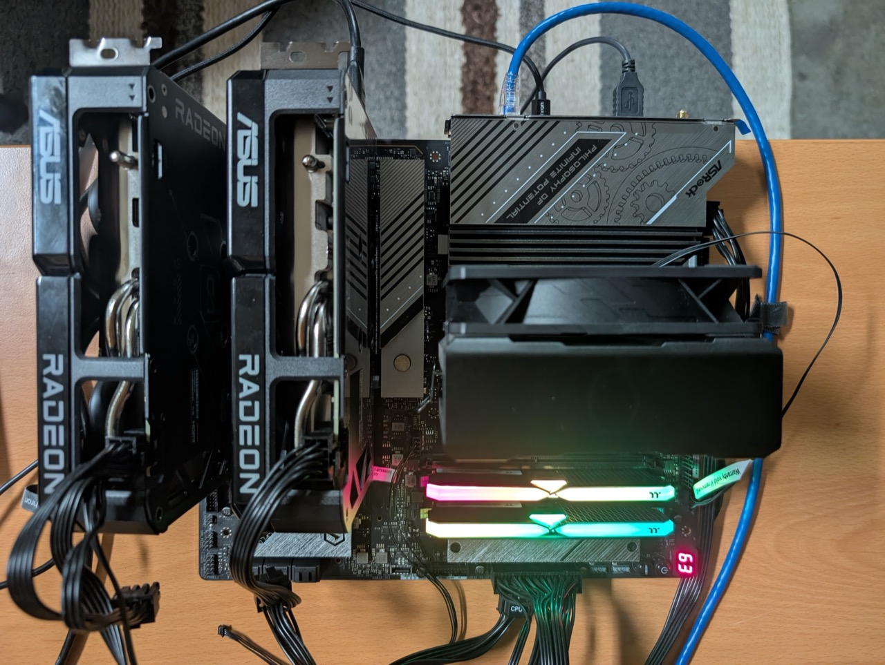

<p align="center">
&nbsp;&nbsp;&nbsp;
</p>

<p align="center">
  Run Qwen3.5-397B at <b>5–9 tok/s</b> on a <b>$2,100</b> desktop.<br><br>
  From-scratch C/HIP MoE inference with multi-tier caching and cache-aware routing.
</p>

<p align="center">
<a href="#quick-start">Quick Start</a> &bull;
<a href="#how-it-works">How It Works</a> &bull;
<a href="#hardware">Hardware</a> &bull;
</p>

---

https://github.com/user-attachments/assets/54c39239-32aa-4db4-b53e-c97acd79e555

**Qwen3.5-397B** (17B active, Q4_K_M)

| Mode | tok/s | PPL |
|------|------:|-----|
| Baseline (no expert substitution) | **5.1** | baseline |
| FOMOE (low substitution) | **6.5** | +3.2% |
| FOMOE (moderate substitution) | **8.8** | +8.0% |

> Single-user, single-batch generation. PPL on WikiText (coldstart, warmup=512).

---

## Hardware

<p align="center">
  
  <br><em>The FOMOE system: 2x RX 9060 XT, X870E, 32GB DDR5, Gen5 NVMe</em>
</p>

| Component | Spec | Cost |
|-----------|------|-----:|
| 2x AMD RX 9060 XT | 16 GB VRAM each, RDNA 4 | $1,000 |
| DDR5 RAM | 32 GB | $330 |
| NVMe Gen5 SSD | 1 TB (14.5 GB/s read) | $200 |
| Taichi lite X870E motherboard | PCIe 5.0 x8/x8 | $300 |
| AMD Ryzen 5 7600X 6-Core | 12 cores | $180 |
| PSU | 850W | $90 |
| **Total** | | **$2,100** |

> **BIOS setting:** X870E PCIe bifurcation must be set to x8/x8. This gives each GPU a dedicated Gen5 x8 link (28 GB/s SDMA). The default x16/x0 leaves one GPU on x4, halving its bandwidth.

---

## Quick Start

### Build

```bash
USE_GPU=1 make            # GPU build (requires ROCm/hipcc, targeting gfx1200)
make                      # CPU-only build
```

### Prepare expert stores

```bash
tools/prepare_experts model.gguf /mnt/nvme1
```

Supports multiple drives with the same store file.

### Run

```bash
# Interactive chat (recommended — warmup seeds cache from prompt)
QMOE_PINGPONG=1 QMOE_CAR_THRESHOLD=0.35 QMOE_CAR_WARMUP=0 \
  ./qwen-moe chat --ram-cache 16000 --freq-profile 397b.freq \
  --max-tokens 128 --no-eos \
  model.gguf store1.qmoe [store2.qmoe]
```

```bash
# Full fidelity (no CAR substitution)
QMOE_PINGPONG=1 QMOE_CAR_THRESHOLD=1.0 \
  ./qwen-moe generate --ram-cache 16000 \
  model.gguf store1.qmoe -- "Your prompt here"
```

### Perplexity evaluation

```bash
# Download WikiText-2 test set
python3 -c "
from datasets import load_dataset
ds = load_dataset('Salesforce/wikitext', 'wikitext-2-raw-v1', split='test')
open('wiki.test.raw','w').write('\n'.join(ds['text']))
"
```

```bash
# Evaluate perplexity (WikiText, coldstart)
QMOE_PINGPONG=1 QMOE_CAR_THRESHOLD=0.35 QMOE_CAR_WARMUP=512 \
  ./qwen-moe ppl --ram-cache 16000 --ppl-ctx 512 --ppl-chunks 40 \
  model.gguf store1.qmoe [store2.qmoe] -- @wiki.test.raw
```

```bash
# Resumable perplexity (saves per-chunk NLL to checkpoint file)
QMOE_PINGPONG=1 QMOE_CAR_THRESHOLD=0.35 QMOE_CAR_WARMUP=512 \
  ./qwen-moe ppl --ram-cache 16000 --ppl-ctx 512 --ppl-chunks 40 \
  --ppl-resume ppl.ckpt \
  model.gguf store1.qmoe [store2.qmoe] -- @wiki.test.raw
```

### Generate a frequency profile

```bash
./qwen-moe profile --max-tokens 150 model.gguf store1.qmoe -- "A diverse prompt" output.freq
```

<details>
<summary><b>Environment variables</b></summary>

| Variable | Description |
|----------|-------------|
| `QMOE_PINGPONG=1` | Enable ping-pong dual-GPU mode |
| `QMOE_CAR_THRESHOLD=F` | CAR threshold (0.35 fast mode, 1.0 disables) |
| `QMOE_CAR_WARMUP=N` | CAR=1.0 for first N tokens to seed cache |
| `QMOE_PREFETCH_BUDGET=N` | NVMe prefetch budget (0 recommended for 397B) |
| `QMOE_DEBUG=N` | 0=silent, 1=per-token stats, 2=per-layer detail |
| `QMOE_BACKFILL_N=N` | Backfill batch size per dispatch (1-16, default 4) |
| `QMOE_NO_BACKFILL=1` | Disable background backfill |
| `QMOE_PREV_PF=1` | Enable prev-token NVMe prefetch (experimental) |

</details>

<details>
<summary><b>CLI options</b></summary>

| Option | Default | Description |
|--------|---------|-------------|
| `--freq-profile PATH` | none | Seed caches from frequency profile |
| `--ram-cache MB` | auto | DRAM cache size (16000 recommended) |
| `--max-tokens N` | 256 | Maximum tokens to generate |
| `--no-eos` | off | Don't stop on EOS tokens |
| `--ppl-ctx N` | 512 | Context size for perplexity chunks |
| `--ppl-chunks N` | all | Max chunks to evaluate |
| `--ppl-resume FILE` | none | Checkpoint file for resumable ppl (appends per-chunk NLL) |

</details>

---

## The Challenge

MoE models are sparse. Qwen3.5-397B activates only 10 of 512 experts per layer, but you still need all 218 GB of expert weights (at Q4_K_M) accessible at low latency. RAM and VRAM are too expensive. The fallback is NVMe, but naive offloading hits a wall:

**You can't read experts until the router picks them, and you can't compute until they arrive.** Across 60 layers these stalls compound. Pure NVMe streaming tops out at ~0.5 tok/s, and even with perfect bandwidth utilization the ceiling is ~3 tok/s on a top-of-the-line Gen5 drive.

We break through this ceiling by making most expert reads unnecessary.

---

## How It Works

### Ping-pong dual-GPU

Two RX 9060 XTs alternate layers — GPU 0 owns even layers, GPU 1 owns odd. A 16 KB hidden state bounces between them through pinned memory. No AllReduce, no collective communication. Each layer runs entirely on one device.

The win: **doubling GPUs doubles VRAM cache capacity**, which is the single biggest lever for reducing NVMe reads.

### Cache-aware routing (CAR)

> **Experimental.** CAR increases throughput by substituting uncached experts, but the impact on downstream task accuracy (beyond perplexity) has not been fully characterized. Use CAR=1.0 (disabled) for full fidelity (Q4_K_M).

When the router selects an expert that isn't in cache, CAR finds the highest-scoring cached alternative and substitutes it if the score ratio exceeds a threshold. Specifically, for each uncached expert $E$ with router score $s_E$:

1. Scan all cached experts not already selected, find the one with highest router score $s_C$
2. Compute the ratio: $r = s_C / s_E$
3. If $r \geq \tau$ (threshold), substitute $C$ for $E$ and renormalize the routing weights
4. If $r < \tau$, no substitution — the original expert is loaded from DRAM or NVMe (blocking)

This is smooth and tunable — higher $\tau$ means only very close substitutes are accepted, and more experts fall through to NVMe:

```
CAR threshold    tok/s    PPL overhead
───────────────────────────────────────
1.00 (off)        5.1     baseline
0.50              6.5     +4.0%
0.35 (rec.)       8.8     +8.2%
```

> PPL measured on WikiText with 40 chunks (10K tokens), coldstart, warmup=512. Please note perplexity using CAR depends on the system setup and backfill rate achieved by the nvme. Making CAR deterministic across nvme speeds is wip.

### Three-tier cache

Expert usage is highly skewed where a small fraction of experts handle most tokens. Caches can be seeded at startup via an offline frequency profile, or self-seeded at runtime using the warmup phase:

| Tier | Capacity | Hit rate (CAR=1.0) | Hit rate (CAR=0.35) | Latency |
|------|----------|----------|----------|---------|
| VRAM (per-GPU) | 51+48 slots/layer | ~60% | ~47% | 0 ms (in-place) |
| DRAM (pinned) | 36 slots/layer, 16 GB | ~12% | ~7% | ~0.2 ms H2D |
| CAR substitution | — | — | ~42% | 0 ms |
| NVMe | Full 218 GB store | ~28% | ~7% | ~0.5 ms/expert |

VRAM hits refresh DRAM expert cache timestamps, so when an expert is evicted from VRAM, the DRAM copy is still fresh.

### Background backfill

CAR alone has a cache divergence problem: substituted experts never get loaded, so the cache drifts from what the router actually wants. A background thread loads substituted experts from NVMe into DRAM during idle I/O windows (the attention phase, when NVMe is idle), prioritizing experts where substitution quality was poorest (most needed). Next token, it's a DRAM hit instead of another substitution. In experiments, **reduces CAR's perplexity overhead by up to 80% at zero throughput cost.**

Closing this distribution gap further is ripe for future work. One direction is to explicitly track the divergence between the router's true expert distribution and the cache-biased distribution, and use this signal to drive cache eviction and backfill priority.
  
### Warmup

`QMOE_CAR_WARMUP=N` forces CAR=1.0 (no substitutions) for the first N tokens. During warmup, all experts load from NVMe, seeding the VRAM and DRAM caches with real expert data. After warmup, CAR activates with a hot cache. This can be used in conjunction or to replace frequency seeding.

---

## Acknowledgments

The majority of this codebase was written by [Claude](https://claude.ai) (Anthropic), with architecture and direction by [Paul Merolla](https://x.com/paul_merolla).

## License

[MIT](LICENSE)
